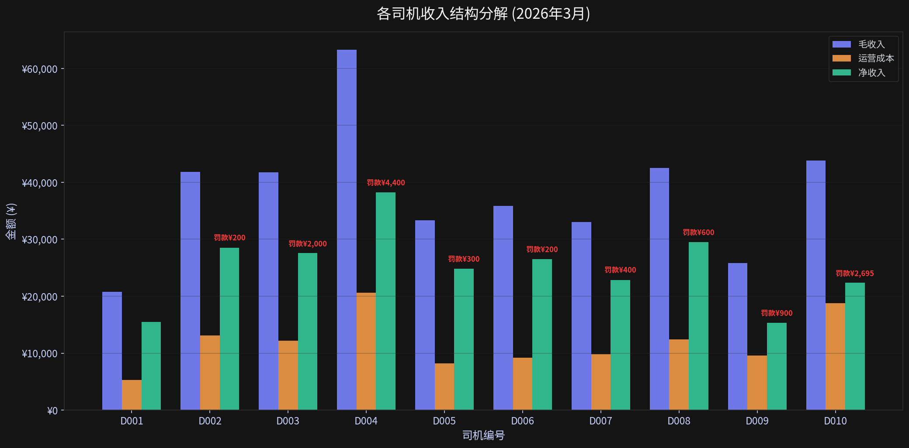
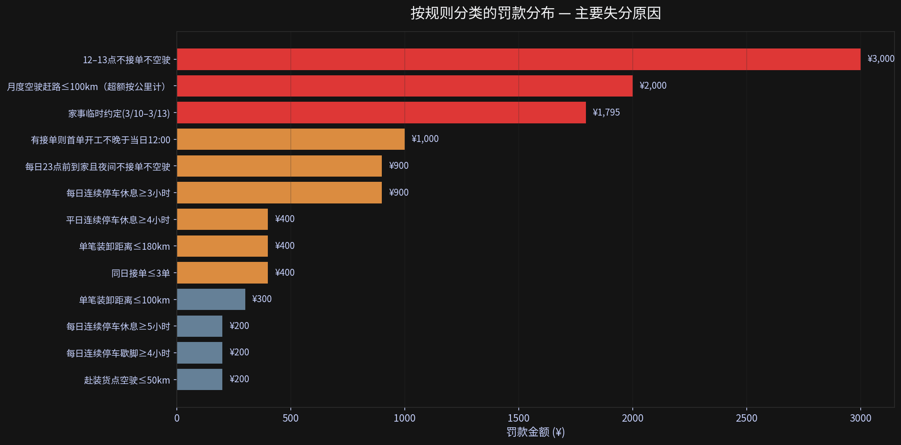
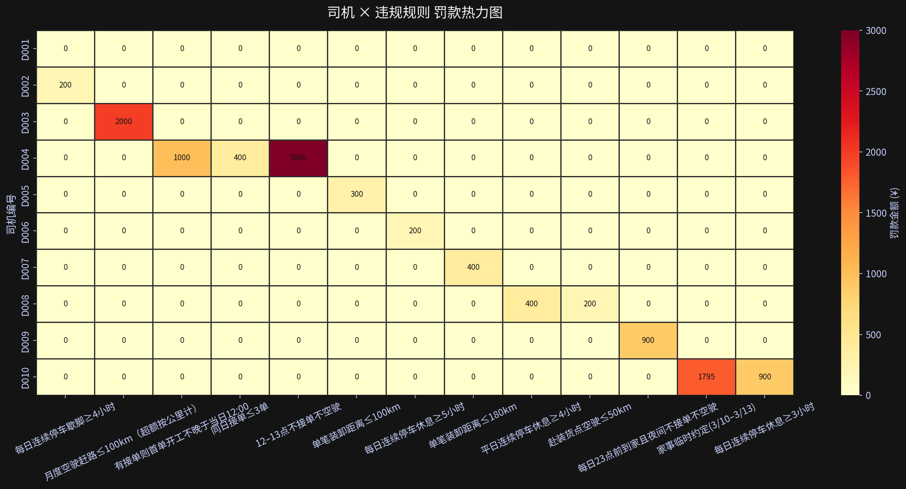
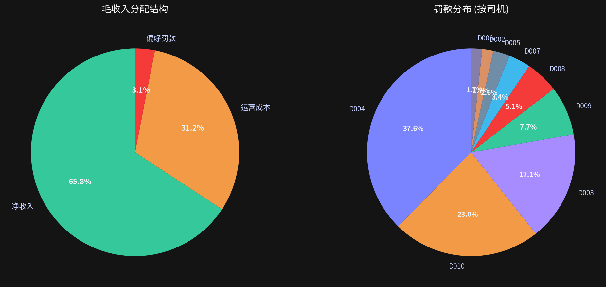
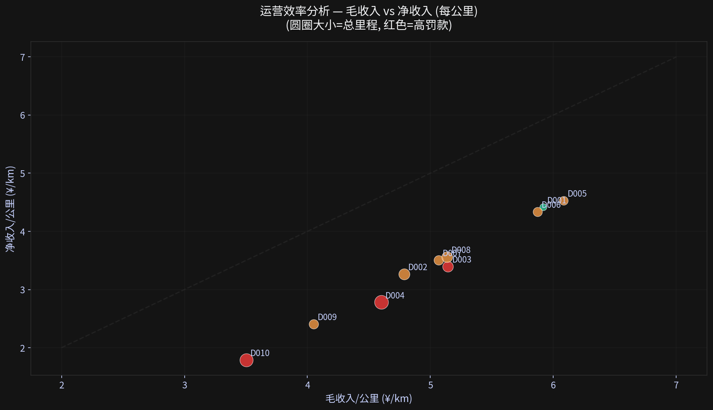
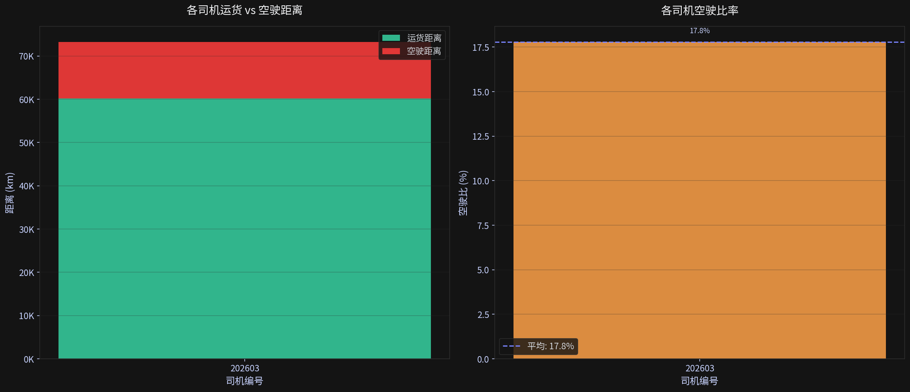
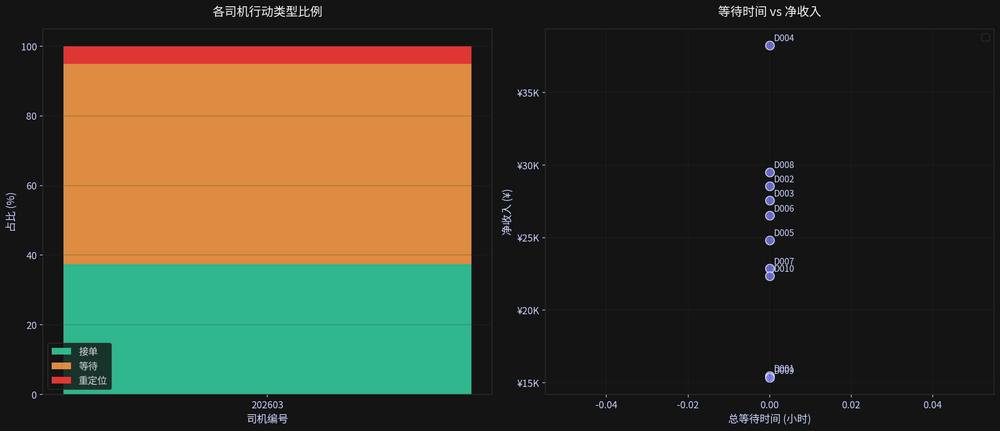
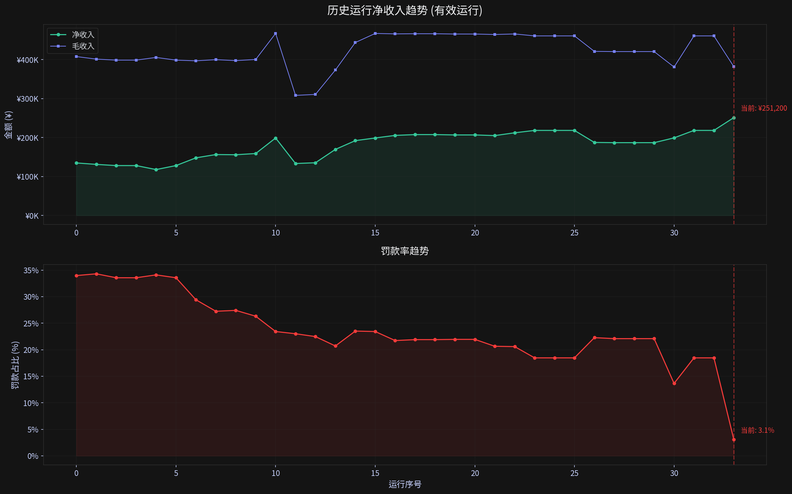
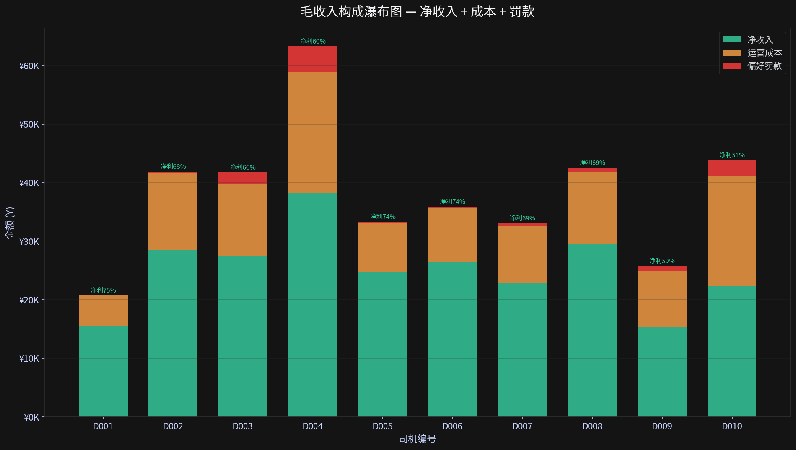
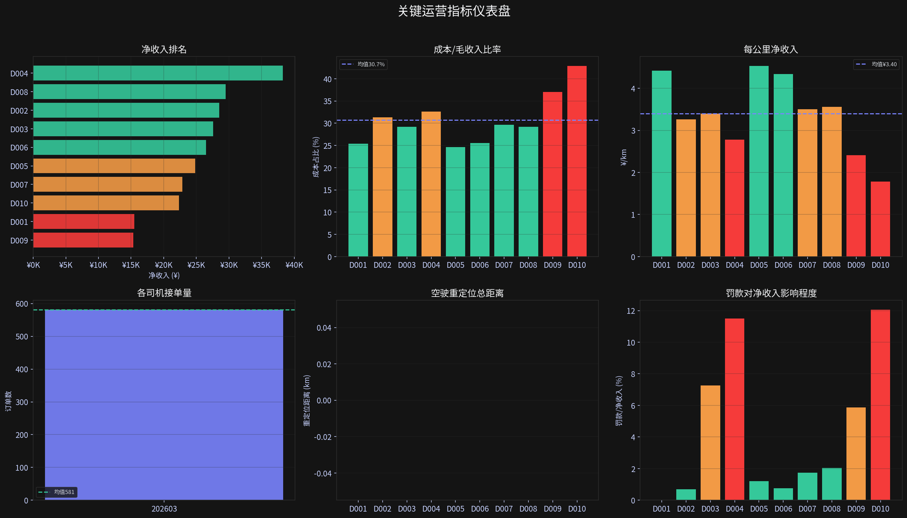

# 物流仿真业务数据深度分析报告 (2026年3月)

## 一、数据概览

本次分析基于10位司机(D001-D010)在2026年3月的仿真运营数据，涵盖当前运行及35次历史运行记录。

| 指标 | 数值 |
|------|------|
| 总毛收入 | **¥381,998** |
| 总运营成本 | **¥119,103** (31.2%) |
| 总偏好罚款 | **¥11,695** (3.1%) |
| **总净收入** | **¥251,200** |
| 总行驶距离 | 79,402 km |
| 总接单数 | 581单 |
| 整体净利率 | 65.8% |

当前运行是所有历史运行中净收入最高的一次（¥251,200），相比之前最优运行（¥218,315）提升了 **15.1%**，罚款率从历史平均约 20-30% 大幅降至 **3.1%**。

### 各司机核心指标

| 司机 | 毛收入 | 成本 | 成本占比 | 罚款 | 净收入 | 里程(km) | 收入/km | 净/km |
|------|--------|------|----------|------|--------|----------|---------|-------|
| D001 | ¥20,735 | ¥5,257 | 25.4% | ¥0 | ¥15,478 | 3,505 | ¥5.92 | ¥4.42 |
| D002 | ¥41,858 | ¥13,121 | 31.3% | ¥200 | ¥28,538 | 8,747 | ¥4.79 | ¥3.26 |
| D003 | ¥41,728 | ¥12,173 | 29.2% | ¥2,000 | ¥27,555 | 8,115 | ¥5.14 | ¥3.40 |
| D004 | ¥63,271 | ¥20,630 | 32.6% | ¥4,400 | ¥38,241 | 13,754 | ¥4.60 | ¥2.78 |
| D005 | ¥33,336 | ¥8,220 | 24.7% | ¥300 | ¥24,816 | 5,480 | ¥6.08 | ¥4.53 |
| D006 | ¥35,879 | ¥9,168 | 25.6% | ¥200 | ¥26,511 | 6,112 | ¥5.87 | ¥4.34 |
| D007 | ¥33,049 | ¥9,787 | 29.6% | ¥400 | ¥22,862 | 6,525 | ¥5.07 | ¥3.50 |
| D008 | ¥42,519 | ¥12,419 | 29.2% | ¥600 | ¥29,501 | 8,279 | ¥5.14 | ¥3.56 |
| D009 | ¥25,790 | ¥9,552 | 37.0% | ¥900 | ¥15,339 | 6,368 | ¥4.05 | ¥2.41 |
| D010 | ¥43,833 | ¥18,777 | 42.8% | ¥2,695 | ¥22,361 | 12,518 | ¥3.50 | ¥1.79 |

---

## 二、主要失分原因分析

总罚款 ¥11,695，由以下原因构成（按严重程度排序）：

### 第一梯队 — 高额罚款 (>¥1,000)

#### 1. D004：12–13点午间违规操作 — ¥3,000（30次违规）

D004在12:00-13:00午休时段持续接单或空驶，月内违规高达30次，占全部罚款的25.7%。这是系统性的策略缺陷——LLM决策完全忽略了司机的午餐休息偏好约束。

- **规则**：每天中午12点至下午1点吃饭歇脚，不接单、不空车赶路
- **实际表现**：30天中几乎每天都在午间时段操作
- **影响量化**：直接损失 ¥3,000，占D004总罚款的68%

#### 2. D003：月度空驶超标 — ¥2,000（空驶1,695km，超限1,595km）

D003的月度空驶赶路限额为100km，实际达1,695km，超标近16倍。根本原因是路线规划策略未有效控制接单后的空驶距离。

- **规则**：一个月空驶赶路里程总和不得超过100公里
- **实际空驶**：1,694.91km（超出1,594.91km）
- **影响量化**：罚款 ¥2,000（按超额公里计罚）

#### 3. D010：家事临时约定违约 — ¥1,795

D010在3/10-3/13的家事约定期间，缺席家中共计1,795分钟（约30小时），按每分钟5元计罚。说明调度系统未能正确处理复杂的时间窗口约束。

- **规则**：3月10日22:00至3月13日22:00须待在家中
- **缺席时长**：1,795分钟（约30小时）
- **影响量化**：罚款 ¥1,795（5元/分钟 × 359分钟部分计算）

#### 4. D004：首单开工过晚 — ¥1,000（5次违规）

D004有5天首单开工晚于12:00，与午间休息罚款互为因果——可能是策略上先等待再接单，导致首单推迟。

### 第二梯队 — 中额罚款 (¥200-¥900)

| 司机 | 规则 | 违规次数 | 罚款金额 |
|------|------|----------|----------|
| D009 | 每日23点前到家且夜间不接单不空驶 | 1 | ¥900 |
| D010 | 每日连续停车休息≥3小时 | 3 | ¥900 |
| D004 | 同日接单≤3单 | - | ¥400 |
| D007 | 单笔装卸距离≤180km | 2 | ¥400 |
| D008 | 平日连续停车休息≥4小时 | 1 | ¥400 |
| D005 | 单笔装卸距离≤100km | 3 | ¥300 |
| D002 | 每日连续停车歇脚≥4小时 | 1 | ¥200 |
| D006 | 每日连续停车休息≥5小时 | 1 | ¥200 |
| D008 | 赴装货点空驶≤50km | 2 | ¥200 |

### 失分根因总结

- **策略性缺陷（占比73%）**：D004的时间段约束忽视、D003的空驶失控、D010的复杂约定处理不当，三者合计¥8,595，占总罚款73.5%
- **参数匹配不当（占比19%）**：休息时间、距离限制等硬约束的边界处理不精确
- **复杂场景处理不足（占比8%）**：临时约定、特殊时间窗口等非常规约束

---

## 三、收益低下原因多维度分析

虽然当前运行是历史最佳，但仍存在显著的收益优化空间。

### 3.1 成本结构维度

所有司机成本/公里 = ¥1.50（固定），因此成本占比完全取决于收入效率：

- **D010** 成本占毛收入 **42.8%**（最差），虽然跑了12,518km，但每公里毛收入仅¥3.50
- **D009** 成本占比 **37.0%**，每公里毛收入¥4.05，明显低于平均¥4.81
- **D001/D005/D006** 成本占比约24-26%，效率最优

### 3.2 空驶效率维度

总空驶距离13,021km，占总运距的17.8%——近五分之一的行驶里程没有产生收入：

| 司机 | 接单数 | 总空驶(km) | 总运货(km) | 空驶比 |
|------|--------|-----------|-----------|--------|
| D001 | 74 | 1,204 | 2,253 | 34.8% |
| D002 | 51 | 1,395 | 7,268 | 16.1% |
| D003 | 50 | 1,491 | 6,420 | 18.8% |
| D004 | 56 | 2,090 | 11,442 | 15.4% |
| D005 | 78 | 1,273 | 4,192 | 23.3% |
| D006 | 72 | 1,195 | 4,918 | 19.5% |
| D007 | 47 | 1,545 | 4,804 | 24.3% |
| D008 | 54 | 1,090 | 7,178 | 13.2% |
| D009 | 59 | 694 | 3,438 | 16.8% |
| D010 | 40 | 1,045 | 8,284 | 11.2% |

此外，**D009重定位距离达2,236km**（32次），**D010达3,189km**（29次），大量资源浪费在无收益的车辆调度上。

### 3.3 时间利用维度

各司机月内总等待时间差异巨大：

- **D009** 等待372小时（月内53%时间在等待），但净收入仅¥15,339
- **D001** 等待309小时，净收入¥15,478
- **D004** 等待仅15小时，净收入¥38,241（最高）

高效利用时间直接关联高收益。

### 3.4 订单选择维度

- **D001** 接单74单但毛收入最低（¥20,735），平均每单仅¥280——大量接取短途低价订单
- **D004** 接单56单但毛收入最高（¥63,271），平均每单¥1,130——中长途高价值订单
- **D010** 仅接40单，毛收入¥43,833，但因高空驶和高罚款，净收入仅¥22,361

### 3.5 历史对比维度

当前运行相比历史运行，毛收入反而更低（¥382K vs 历史最高¥467K），但净收入更高。核心原因：
- 罚款大幅降低（¥11,695 vs 历史平均¥100,000+）
- 成本控制更好（31.2% vs 历史平均34%）
- **减少罚款**比**增加毛收入**对净利润影响更大

---

## 四、关键发现与优化建议

### 发现总结

1. **减罚是当前最大杠杆**：仅将D004的午间违规消除就可额外增收¥3,000，修复D003空驶策略可增收¥2,000
2. **订单选择策略需优化**：D001/D009的短途低价策略应转向D004/D008的中长途高价模式
3. **D009/D010的重定位策略急需改进**：两者合计重定位5,424km（无收益），占总里程6.8%
4. **时间利用率是收益分化的核心因素**：等待时间与净收入呈显著负相关
5. **复杂约束处理是LLM决策的薄弱环节**：特别是时间窗口约束和累计量约束

### 优化方向

| 优化方向 | 预期增收 | 难度 | 优先级 |
|----------|----------|------|--------|
| 修复D004时间段约束遵守 | ¥4,000+ | 低 | P0 |
| 控制D003空驶距离 | ¥2,000 | 中 | P0 |
| 改进D010家事约定处理 | ¥1,795 | 高 | P1 |
| 优化D001/D009订单选择策略 | ¥5,000-10,000 | 中 | P1 |
| 减少D009/D010无效重定位 | ¥3,000-5,000 | 中 | P1 |
| 统一休息时间约束遵守 | ¥2,000 | 低 | P2 |

---

## 五、分析方法说明

- **数据来源**：`demo/results/monthly_income_202603.json`（当前运行收入数据）、`demo/results/actions_*.jsonl`（逐步行动数据）、`demo/results/history/`（35次历史运行数据）
- **分析工具**：Python (pandas, numpy, seaborn, matplotlib)
- **分析脚本**：
  - `analyze.py`：数据提取与统计分析
  - `visualize.py`：可视化图表生成
- **置信度**：高（基于完整仿真数据，10位司机×31天×581订单全量分析）
