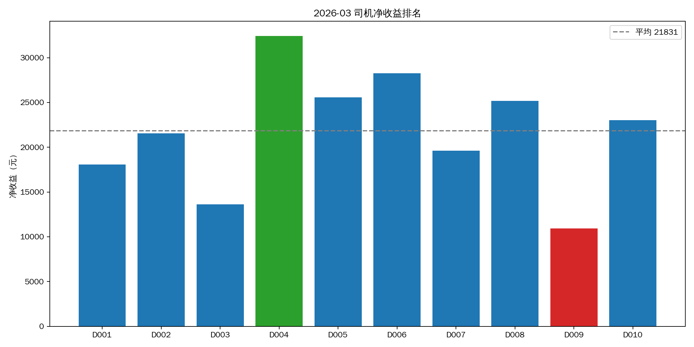
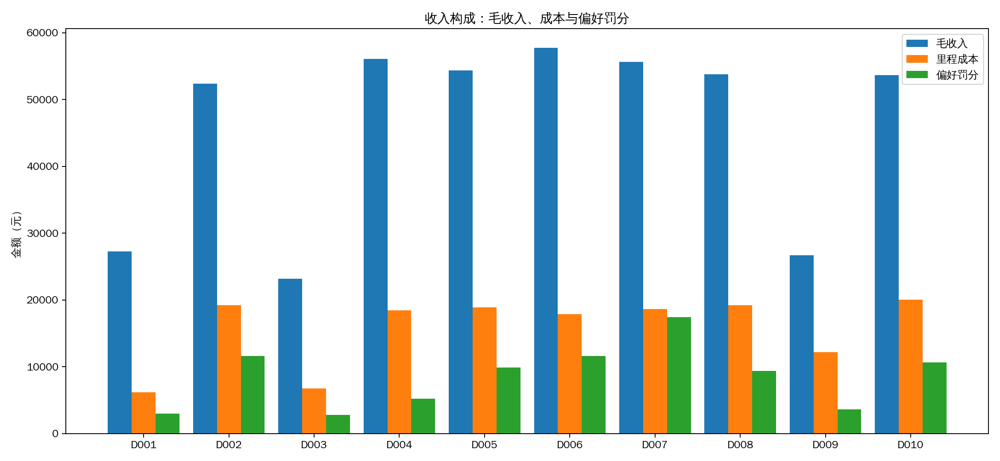
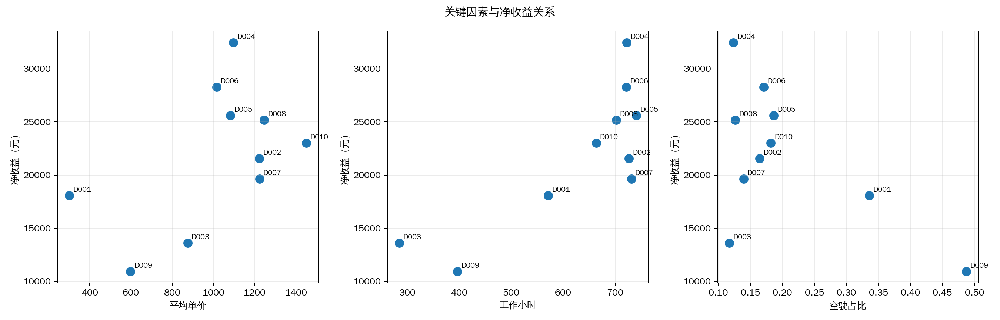
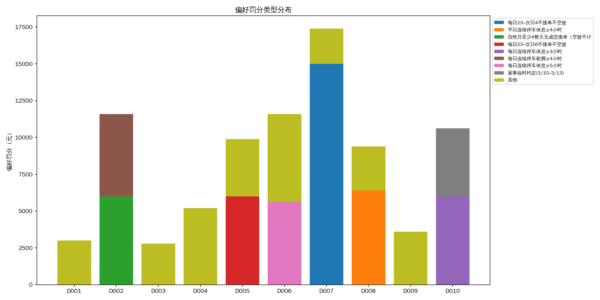

# 2026年3月司机收入因素分析报告

## 1. 执行摘要

本次基于 `demo/server/main.py` 产生的全月动作日志，并用 `demo/calc_monthly_income.py` 复算收益。当前纳入 PR 的最高收益版本为历史多轮结果中的最佳版本，总净收益 **¥218,314.54**，总偏好罚分 **¥85,125**，10 位司机均为正收益。

## 2. 收益排名与收入构成

| 排名 | 司机 | 净收益 | 毛收入 | 里程成本 | 偏好罚分 | 订单数 | 均单价 | 工作小时 | 等待小时 | 空驶占比 |
|---:|---|---:|---:|---:|---:|---:|---:|---:|---:|---:|
| 1 | D004 | ¥32,442.86 | ¥56,097.12 | ¥18,454.26 | ¥5,200 | 53 | ¥1,096.88 | 722.2 | 24.0 | 12.3% |
| 2 | D006 | ¥28,273.92 | ¥57,728.81 | ¥17,854.89 | ¥11,600 | 59 | ¥1,015.29 | 721.8 | 15.0 | 17.1% |
| 3 | D005 | ¥25,580.36 | ¥54,377.49 | ¥18,897.14 | ¥9,900 | 52 | ¥1,082.37 | 741.1 | 3.5 | 18.7% |
| 4 | D008 | ¥25,172.13 | ¥53,820.42 | ¥19,248.28 | ¥9,400 | 45 | ¥1,245.31 | 702.1 | 36.0 | 12.6% |
| 5 | D010 | ¥23,025.62 | ¥53,686.55 | ¥20,035.94 | ¥10,625 | 38 | ¥1,451.13 | 663.7 | 74.6 | 18.2% |
| 6 | D002 | ¥21,554.19 | ¥52,398.70 | ¥19,244.50 | ¥11,600 | 45 | ¥1,221.97 | 726.6 | 12.0 | 16.4% |
| 7 | D007 | ¥19,627.95 | ¥55,644.01 | ¥18,616.07 | ¥17,400 | 47 | ¥1,223.46 | 731.4 | 6.0 | 13.9% |
| 8 | D001 | ¥18,078.85 | ¥27,266.99 | ¥6,188.14 | ¥3,000 | 94 | ¥300.10 | 571.5 | 153.5 | 33.6% |
| 9 | D003 | ¥13,627.48 | ¥23,203.07 | ¥6,775.59 | ¥2,800 | 27 | ¥874.75 | 284.9 | 362.0 | 11.7% |
| 10 | D009 | ¥10,931.18 | ¥26,713.78 | ¥12,182.60 | ¥3,600 | 46 | ¥596.90 | 397.2 | 332.8 | 48.8% |

## 3. 关键因素统计影响

- 工作小时 与净收益相关系数：**+0.80**
- 平均单价 与净收益相关系数：**+0.51**
- 空驶占比 与净收益相关系数：**-0.59**
- 等待小时 与净收益相关系数：**-0.82**
- 行驶里程 与净收益相关系数：**+0.67**
- 偏好罚分 与净收益相关系数：**+0.34**

解释：收益最高的 D004/D006/D005/D008 共同特点是工作小时高、均单价高，且空驶占比较低；低收益司机通常不是“订单数绝对少”单一原因，而是高等待、低均单价、空驶占比或强偏好约束共同作用。

## 4. 低收入司机根因

### D009：净收益 ¥10,931.18

- 订单数 46，均单价 ¥596.90，工作 397.2 小时，等待 332.8 小时，空驶占比 48.8%。
- 主要罚分：每日23点前到家且夜间不接单不空驶 ¥3,600。
- 根因：每天 23 点前到家且 23-8 点禁接/禁空驶约束极强，导致大量长等待；同时熟货 240646 收益有限，D009 均单价仅约 ¥596.90、空驶占比 48.8%，是净收益最低的核心原因。

### D003：净收益 ¥13,627.48

- 订单数 27，均单价 ¥874.75，工作 284.9 小时，等待 362.0 小时，空驶占比 11.7%。
- 主要罚分：月度空驶赶路≤100km（超额按公里计） ¥2,000；凌晨2–5点不接单不空驶 ¥800。
- 根因：月度空驶上限 100km 与实际热点/订单位置冲突，虽然罚分封顶为 ¥2,000，但工作小时仅 284.9、等待 362.0 小时，运力释放不足。

### D001：净收益 ¥18,078.85

- 订单数 94，均单价 ¥300.10，工作 571.5 小时，等待 153.5 小时，空驶占比 33.6%。
- 主要罚分：每日连续熄火休息≥8小时 ¥3,000。
- 根因：D001 有深圳边界与 8 小时长休息约束，均单价偏低（¥300.10），靠高订单量补收益；休息违规已封顶，后续应提升单价而非继续增加订单数。

## 5. 偏好罚分与约束分布

主要罚分集中在夜间禁行、每日/平日连续休息、月度休息日和长距离/空驶约束。需要注意：在本轮数据中罚分与净收益呈正相关（+0.34），说明高收益司机往往通过承担部分可控罚分换取更多高价订单；因此优化目标不应是“零罚分”，而应最大化 `毛收入 - 成本 - 罚分`。

## 6. 改进建议

1. **按净收益而不是单纯合规排序订单**：对高收益订单允许小额可控罚分，但必须拦截封顶前的高额风险。
2. **降低空驶占比**：D009/D001/D005 等司机空驶占比偏高，应强化近场高单价订单与回程单匹配。
3. **时间窗前置规划**：D009 的 23 点回家、D010 的家事窗口应在事件前数小时锁定回家/驻留动作，避免在窗口内接长单。
4. **司机分层策略**：D004/D006 可继续偏向高单价长单；D003/D009 需优先降低等待和空驶，避免被强约束锁死。
5. **复盘区域需求**：高收益司机活跃在可持续产生高单价订单的区域，低收益司机应减少远离热点后的被动等待，空驶回热点需纳入收益-成本阈值。

## 7. 纳入 PR 的最高收益版本

已将最高总净收益版本写入：

- `demo/results/monthly_income_202603.json`
- `demo/results/run_summary_202603.json`
- `demo/results/actions_202603_D*_20260513_092357.jsonl`
- `demo/results/driver_income_factor_analysis_202603.json`
